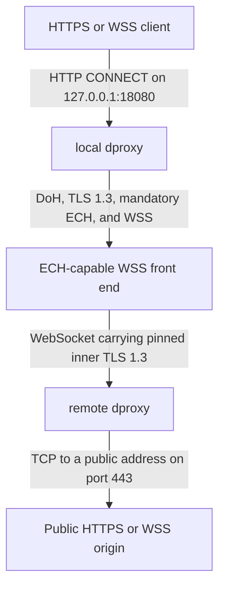

# dproxy

`dproxy` is a discreet encrypted proxy for HTTPS and WebSocket traffic. It runs
a local HTTP `CONNECT` proxy and carries each accepted connection through an
[ECH-capable](https://en.wikipedia.org/wiki/Server_Name_Indication#Encrypted_Client_Hello)
WSS relay without terminating or inspecting the application's TLS session.

The `d` means **discreet**. dproxy is not a traffic-obfuscation tool or a TLS
interception service.

Use dproxy when you want a tool's ordinary HTTPS requests to cross an untrusted
network without exposing the destination or application data there. For example,
set `HTTPS_PROXY=http://127.0.0.1:18080` before running Codex or Claude Code.
The same setup works with any client that honors `HTTPS_PROXY`.

> [!TIP]
> Looking for discreet uploads and downloads instead? Check out
> [DUD](https://github.com/wojciechpolak/dud).

## How dproxy works



Three encrypted layers have separate jobs:

1. Outer TLS 1.3 with ECH protects the connection from the local network and
   hides the relay hostname in the TLS handshake.
2. Pinned inner TLS 1.3 hides the token, target hostname, control protocol, and
   application bytes from the WSS front-end operator.
3. The original application TLS session runs from the calling tool to the
   provider. dproxy never decrypts it.

Each local `CONNECT` gets one WSS connection, one inner TLS session, and one
remote TCP connection. v1 does not multiplex connections.

## Stack

| Part              | Technology                                                                                               |
|-------------------|----------------------------------------------------------------------------------------------------------|
| Implementation    | Go 1.26.6, with no third-party modules in the shipped binary                                             |
| Local interface   | HTTP/1.1 `CONNECT` through `HTTPS_PROXY`                                                                 |
| Outer transport   | In-process DoH, DNS HTTPS records, TLS 1.3, mandatory ECH, and WSS                                       |
| Private channel   | Inner TLS 1.3 with a pinned Ed25519 server identity                                                      |
| Tunnel protocol   | Length-prefixed `dproxy/1` control messages, followed by an unframed TCP byte stream                     |
| Remote deployment | Non-root Docker image behind a provider-neutral WSS front end; Cloudflare Tunnel is the included example |
| Distribution      | Reproducible macOS and Linux binaries and archives, checksums, provenance, Homebrew, and GHCR            |

The shipped Go binary does not depend on Docker or Cloudflare; those belong to
the remote deployment.

## Security rules

dproxy fails closed. It does not retry with weaker transport settings.

- DNS uses an in-process DNS-over-HTTPS resolver. There is no operating-system
  DNS fallback.
- The outer connection requires TLS 1.3, a valid public certificate, an HTTPS
  DNS record with ECH configuration, and an accepted ECH handshake.
- The inner connection requires TLS 1.3 and a matching remote identity pin.
- By default, any hostname on port 443 is eligible. Operators can configure
  independent local and remote allowlists to narrow that policy.
- Only hostname destinations on port 443 are accepted. IP literals and resolved
  private, loopback, link-local, multicast, unspecified, or otherwise reserved
  addresses are rejected.
- Tokens, application traffic, and destination hostnames are omitted from logs
  by default.
- At the default `info` level, the client and server each record a successful
  connection. The destination remains redacted unless the operator enables
  `log.include_targets` or passes `--log-targets`.

See [the threat model](docs/threat-model.md) for trust boundaries, known limits,
and the threats v1 does not try to solve.

## Requirements

- macOS or Linux on arm64 or amd64 for a prebuilt binary, or Go 1.26.6 to build
  it
- Docker and an ECH-capable TLS/WSS front end for the remote relay deployment

The shipped binary uses only the Go standard library. Development tools live in
a separate module under `tools/`.

## Install with Homebrew

Install the latest stable release from the project tap:

```sh
brew install wojciechpolak/dproxy/dproxy
dproxy --version
```

Homebrew checks the architecture-specific archive against the SHA-256 digest in
the formula. Releases also carry signed GitHub build provenance for independent
verification. See [the release guide](docs/release.md) for verification,
upgrade, uninstall, and maintainer instructions.

## Download a prebuilt binary

Download the latest stable Linux amd64 binary with `curl`:

```sh
curl -fL -o dproxy \
  https://github.com/wojciechpolak/dproxy/releases/latest/download/dproxy-linux-amd64
sudo install -m 0755 dproxy /usr/local/bin/dproxy
dproxy --version
```

Release assets are plain HTTPS downloads, so GitHub CLI is not required.
`/releases/latest/download/` resolves to the newest stable release and never to
a prerelease tag. Use `/releases/download/vX.Y.Z/` to pin a version. Choose the
platform with `dproxy-linux-amd64`, `dproxy-linux-arm64`, `dproxy-darwin-amd64`,
or `dproxy-darwin-arm64`.

With GitHub CLI installed, the same download is:

```sh
gh release download vX.Y.Z --pattern 'dproxy-linux-amd64'
sudo install -m 0755 dproxy-linux-amd64 /usr/local/bin/dproxy
```

The [release guide](docs/release.md) explains how to verify the binary checksum
and GitHub build attestation before installing it.

## Build from source

```sh
git clone https://github.com/wojciechpolak/dproxy.git
cd dproxy
make build
./bin/dproxy version
```

The binary is written to `bin/dproxy`.

## Deploy the remote relay

The v1 relay is a non-root Go container behind a WSS front end. The front end
must publish ECH in DNS, accept ECH with TLS 1.3, present a publicly trusted
certificate, support WebSockets, and forward `/v1/tunnel` to dproxy over
HTTP/1.1.

The published remote-server image supports Linux on arm64 and amd64. Pull the
latest stable release with:

```sh
docker pull ghcr.io/wojciechpolak/dproxy:latest
```

Stable releases also publish `X.Y.Z` and `X.Y` tags. Use a full `X.Y.Z` tag when
you need deliberate upgrades. To use the published image with the included
Compose deployment, remove the `build` block from the `dproxy` service and set:

```yaml
image: ghcr.io/wojciechpolak/dproxy:latest
```

The [release guide](docs/release.md) includes the image attestation command.

The relay hostname can be public, but the relay is not an open proxy. Remote
dproxy requires the shared secret token before it resolves or connects to any
destination. A client without the token cannot use the relay. Treat the token as
a bearer credential: anyone who obtains a copy can use the relay until you
rotate it.

The included Compose setup uses Cloudflare Tunnel because it provides this
combination conveniently and keeps the dproxy listener off the host network.
Cloudflare is not required. Another container host, ingress, or edge service is
compatible when it meets the same transport and listener-isolation rules.

Follow [the deployment guide](docs/deployment.md) to create the token and
persistent inner-TLS identity, configure the `/v1/tunnel` public hostname, start
the containers, and record the server's `sha256:` identity pin.

Do not expose the dproxy container directly or put credentials in the image,
environment, or command line.

## Configure the local client

Transfer these two values from the remote deployment to each client:

- the contents of `secrets/dproxy_token`, which become the client's token file;
- the `identity_pin=sha256:...` value printed when the server starts, which
  becomes `server_pin` in the client configuration.

Use an authenticated secure channel for both. Keep `secrets/dproxy_token`
confidential because it is a bearer credential. The identity pin is safe to
disclose, but the client must receive the correct value so it can detect an
impostor. Never copy `state/identity.pem` to a client. It contains the server's
private key. The Cloudflare Tunnel token is also server-side only.

The client token file must contain the exact same bytes as
`secrets/dproxy_token`. Store it under the XDG configuration directory with mode
0600, then copy the example configuration. dproxy uses `$XDG_CONFIG_HOME` when
set and `~/.config` otherwise, including on macOS.

```sh
config_home="${XDG_CONFIG_HOME:-$HOME/.config}"
mkdir -p "$config_home/dproxy"
install -m 600 /path/to/copied/dproxy_token "$config_home/dproxy/token"
cp configs/client.example.toml "$config_home/dproxy/client.toml"
```

Without `--config`, `dproxy client` and `dproxy test` load `dproxy/client.toml`
from that directory. `dproxy server` looks for `dproxy/server.toml`. A missing
discovered file is fine, so every setting can still come from flags.

Edit `client.toml`:

- set `server` to the public `wss://` relay URL;
- set `server_pin` to the transferred identity pin;
- keep `ech = "required"`;
- leave `allowlist` and `allowlist_file` unset to allow every public hostname on
  port 443. To restrict access to OpenAI and Anthropic, copy
  `configs/allowlist.example` and configure that file on both the client and
  server.

Check the complete transport without proxying application traffic:

```sh
./bin/dproxy test
```

Start the local proxy:

```sh
./bin/dproxy client
```

The native process intentionally stays in the foreground. Run a direct download
or source build under the supervisor provided by the operating system instead of
expecting dproxy to fork or manage a PID file.

The Homebrew formula installs dproxy on macOS and Linux. On macOS it also
supplies an optional per-user service. Configure the client first, then manage
it with:

```sh
brew services start dproxy
brew services info dproxy
brew services restart dproxy
brew services stop dproxy
```

Do not run these commands with `sudo`. Without `sudo`, Homebrew creates a
per-user LaunchAgent that starts at login and reads that user's configuration.
Using `sudo` creates a system service with a different home directory and more
privilege than the loopback client needs. Restart the service after changing
`client.toml`. Its stderr log is under `$(brew --prefix)/var/log/dproxy.log`.

If `XDG_CONFIG_HOME` is set only by shell startup files, a LaunchAgent will not
inherit it. Put `XDG_CONFIG_HOME=/absolute/path` in
`~/.homebrew/services/dproxy.env`, then restart the service, or keep the service
configuration under `~/.config/dproxy`.

Point a client at it:

```sh
export HTTPS_PROXY=http://127.0.0.1:18080
export https_proxy="$HTTPS_PROXY"
```

The local listener accepts HTTP/1.1 `CONNECT` only. It rejects forward HTTP
requests, non-443 ports, IP literals, and destinations outside a configured
allowlist.

Run `dproxy client --help`, `dproxy server --help`, or `dproxy test --help` for
all flags. `--config` overrides automatic discovery. Explicit flags override
values read from the TOML file. Unknown configuration keys are startup errors.

## Development

Run the local quality gate before submitting a change:

```sh
make check
```

It checks formatting, Markdown, module tidiness, the zero-dependency policy,
static analysis, unit tests, coverage, race detection, and known
vulnerabilities. The full CI-equivalent gate also runs deterministic end-to-end
tests:

```sh
make ci
```

The [testing guide](docs/testing.md) covers the end-to-end and public deployment
checks.

## Documentation

- [Protocol v1](docs/protocol-v1.md)
- [Deployment](docs/deployment.md)
- [Threat model](docs/threat-model.md)
- [Testing](docs/testing.md)
- [Releases and Homebrew](docs/release.md)

## License

dproxy is available under the [MIT License](LICENSE).
