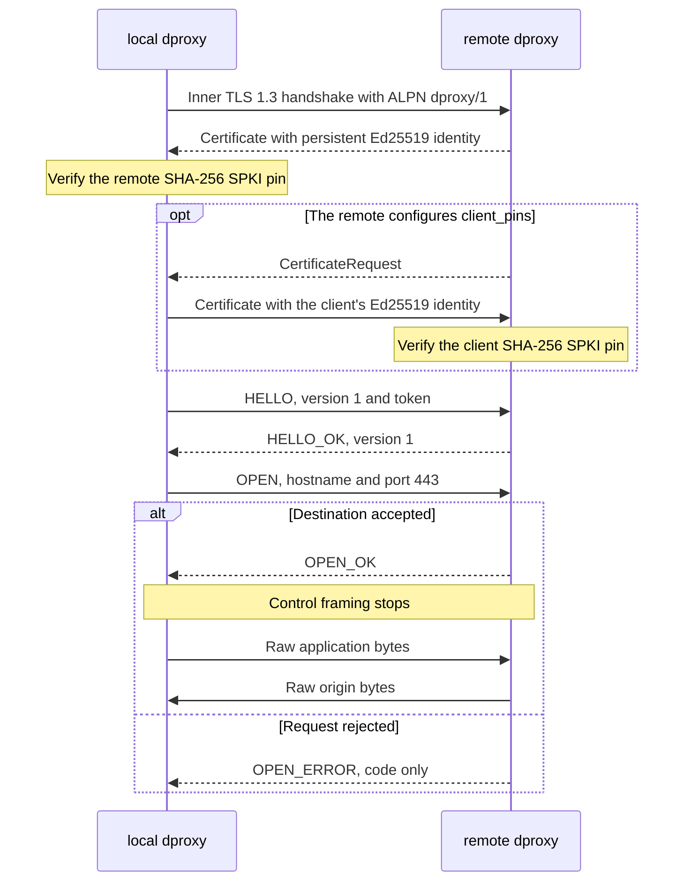

# dproxy/1 inner protocol

`dproxy/1` runs inside TLS 1.3 over the WebSocket byte stream. Both inner TLS
peers offer only `dproxy/1` as ALPN and abort if negotiation produces anything
else.

The remote uses a persistent Ed25519 TLS identity. It stores the self-signed
certificate and private key in one PEM file with mode `0600`. The client does
not use DNS names or public PKI for this connection. It compares the SHA-256
digest of the leaf certificate's DER-encoded SubjectPublicKeyInfo with its
configured `server_pin`. A mismatch ends the connection before the client can
send `HELLO`.

The remote may also require the reverse, making the inner session mutually
authenticated: optional mTLS, with the client trusted by pinned public key
rather than by a certificate authority. When its `client_pins` list is non-empty
the remote requests a client certificate and compares the SHA-256 SPKI digest of
the presented leaf with that list, rejecting the handshake before `HELLO` is
read. This is a requirement in addition to the token, never a replacement, and
it is a TLS-layer addition only: the `dproxy/1` message set, framing, and
version are identical in both configurations, so there is no version bump and no
negotiation. With an empty `client_pins` no certificate is requested and a
client that has one configured transmits nothing.

## Session sequence

One connection has this fixed exchange:

The token appears only in `HELLO`. The client sends that message after inner TLS
and pin verification return successfully. `OPEN` cannot precede an accepted
`HELLO`. After `OPEN_OK`, both peers stop decoding frames and treat every byte
as application data.

TLS 1.3 completes the client's handshake before the remote validates a client
certificate. A client the remote is about to refuse therefore finishes its dial
and may emit its `HELLO` record, and learns of the refusal as a TLS alert on its
first read. The remote aborts before reading that client's Finished message: it
never derives the keys to decrypt the record and never reaches destination
policy. The record reaches only the remote the client already pin-verified.

## Framing

Every control message starts with a four-byte unsigned length in network byte
order. The length covers the message type and payload, but not the length field
itself. A zero length is invalid. Each peer rejects a length above its
configured control-message limit before allocating or reading the body.

Integers use network byte order. Text is UTF-8 where the hostname grammar allows
it, though canonical protocol hostnames are ASCII after policy validation. There
is no padding and no optional field in version 1.

| Type | Name         | Body after the one-byte type                |
|-----:|--------------|---------------------------------------------|
|    1 | `HELLO`      | version `u8`, token bytes                   |
|    2 | `HELLO_OK`   | version `u8`                                |
|    3 | `OPEN`       | hostname length `u16`, hostname, port `u16` |
|    4 | `OPEN_OK`    | empty                                       |
|    5 | `OPEN_ERROR` | error code `u16`                            |

The protocol version byte is `1`. An unknown version returns an explicit
unsupported-version error. There is no version fallback or best-effort decoding.

`HELLO` consumes the rest of its frame as the token. The token must contain 32
to 4094 bytes. The upper bound leaves room for the type and version in the
default 4096-byte control-message limit.

`OPEN` carries a canonical hostname and port `443`. The decoder rebuilds a
`policy.Destination`, which rejects IP literals, malformed names, and other
ports before remote policy evaluation.

## OPEN_ERROR codes

| Code | Meaning                   |
|-----:|---------------------------|
|    1 | unauthenticated           |
|    2 | forbidden destination     |
|    3 | resolution failed         |
|    4 | resolved address rejected |
|    5 | outbound dial failed      |
|    6 | server limit exceeded     |
|    7 | malformed control message |
|    8 | unsupported version       |
|    9 | internal failure          |

The message carries no free text. This keeps remote-controlled strings and
destination details out of normal client logs.

## WebSocket stream rules

The adapter sends each `net.Conn.Write` as one final binary WebSocket message.
It masks client frames and leaves server frames unmasked. Reads join binary and
continuation frames into one byte stream, answer ping frames, ignore pong
frames, and return EOF for a close frame.

The adapter rejects text frames, reserved bits, bad masking, unknown opcodes,
non-canonical lengths, invalid fragmentation, and frames larger than 16 MiB. The
opening handshake offers no WebSocket extension, so reserved bits never have a
negotiated meaning.

WebSocket payloads contain the inner TLS handshake and ciphertext. The token,
target hostname and port, and application bytes exist only inside that TLS
session.
